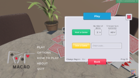

# Макао
# 1. Oпис на проблемот
“Макао” претставува класична друштвена игра со карти во којашто неколку луѓе се натпреваруваат помеѓу себе кој побрзо ќе ги искористи сите свои карти. Овој проект е инспириран од оваа игра и претставува дигитална адаптација на играта “Макао” овозможувајќи друштвена игра на поголеми далечини.

Играта започнува со 7 карти за секој играч, а се игра по принцип на фрлање карта по број или боја. Доколку играчот нема соодветна карта, влече од шпилот. Се користат и специјални карти со ефекти како промена на боја, прескокнување потег или додавање карти на противникот.

Овој проект има за цел да ја преслика играта "Макао". Поддржува креирање и приклучување во соби, избор на број на шпилови и време по потег, автоматско следење на правилата, можност за повторно започнување игра, поставување на корисничко име и слика на профил, поддржува локализација за Англиски и Македонски јазик, како и пријатен и интуитивен кориснички интерфејс.
# 2. Опис на решението
Проектот е развиен со помош на алатката за креирање на игри “[Unity](https://unity.com)”, а можноста за конектирање и друштвена игра е постигната со помош на [Photon API](https://www.photonengine.com). “Unity” го користи програмскиот јазик C# каде се користи објектно ориентиран пристап за организација на компонентите во играта. Логиката на играта, менувањето на редот на играчите, картите, зачувување на избраните опции и самиот тек на играта се организирани во повеќе класи, секоја со своја одговорност. Играта подржува најмногу 4 играчи истовремено во една соба.

Во играта се чуваат класи за:

- Картa (именувана [Card](https://github.com/h-gajdov/Macao/blob/master/Assets/Scripts/Card.cs)): ги опишува боите (срце, лист, детелина, коцка кои се организирани во енумерација именувана Suit) и вредност (1-15)
- Рака на играчот (именувана како [CardArranger](https://github.com/h-gajdov/Macao/blob/master/Assets/Scripts/CardArranger.cs)): ги содржи сите карти коишто ги поседува играчот во моментот како и информација за респонзивно прикажување на картите во зависност од ширината и висината на екранот
- Играч (именувана како [Player](https://github.com/h-gajdov/Macao/blob/master/Assets/Scripts/Player.cs)): содржи информации за корисничкото име на играчот, профилната слика како и информации за дали играчот може да фрла карти или не.
- Нефрлени карти (именувана како [CardStackManager](https://github.com/h-gajdov/Macao/blob/master/Assets/Scripts/CardStackManager.cs)): ги содржи картите кои не се доделени на никој и претставува класа со чија помош можеме да овозможиме влечење на карти.
- Состојба на игра (именувана како [GameManager](https://github.com/h-gajdov/Macao/blob/master/Assets/Scripts/GameManager.cs)): која содржи информации за фрлени карти, завршени играчи, моментално фрлена карта и сл.
- Менаџирање на соби (именувана како [RoomManager](https://github.com/h-gajdov/Macao/blob/master/Assets/Scripts/RoomManager.cs)): содржи информации за старт на играта и функции за конекција помеѓу играчите
- Повеќе класи за менаџирање на различни аспекти (како [LobbyManager](https://github.com/h-gajdov/Macao/blob/master/Assets/Scripts/LobbyManager.cs), [RegionManager](https://github.com/h-gajdov/Macao/blob/master/Assets/Scripts/RegionManager.cs), [MainMenuManager](https://github.com/h-gajdov/Macao/blob/master/Assets/Scripts/MainMenuManager.cs) и сл.)
# 3. Опис на Player класата
Класата за играчот “[Player](https://github.com/h-gajdov/Macao/blob/master/Assets/Scripts/Player.cs)” ги претставува сите основни податоци и функции поврзани со секој играч во играта. Таа е одговорна за иницијализација на играчот, прикажување на неговиот профил во различни панели, справување со настани како што се влечење и фрлање карти, завршување на играта како и синхронизација на податоците преку Photon PUN.

**Главни својства:**
```csharp
public class Player : MonoBehaviour {
   public string username;
   public bool ready = false;
   public bool finished = false;
   public int avatarIdx;

   public PlayerInLobby playerInLobbyPanel;
   public PlayerInLeaderboard playerInLeaderboard;
   public PlayerPanel playerPanel;

   public PhotonView PV;
   public CardArranger cardArranger;
}
```
- username (string): името на играчот
- ready (bool): дали играчот е спремен за почеток
- finished (bool): дали играчот ја завршил играта
- avatarIdx (int): индекс за сликата на профилот која можеме да ја извлечеме од класа [Global](https://github.com/h-gajdov/Macao/blob/master/Assets/Scripts/Global.cs) која содржи референци кон слики.
- playerInLobbyPanel, playerInLeaderboard, playerPanel: покажувачи кон UI панели за менаџирање на нивното прикажување на состојбата на играчот
- PV (PhotonView): компонента која овозможува повици на методи меѓу клиенти преку мрежа (главна компонента за синхронизација на играта помеѓу мрежа).
- cardArranger (CardArranger): класа што управува со прикажувањето и распоредувањето на картите во раката на играчот.

**Главни методи:**
```csharp
public class Player : MonoBehaviour {
   private void Start() {...}
   public void ResetSettings() {...}
   public void Finish() {...}
}
```
- Start(): преоптоварување на функција од MonoBehaviour која се повикува на првиот frame кога е активен играчот и проверува дали играта веќе започнала и ако не го иницира играчот и испраќа податоци до сите клиенти преку RPC.
- ResetSettings(): Ја ресетира состојбата на играчот за нова игра (отсранува карти, го крие медалот и сл.)
- Finish(): Ја означува играта како завршена за играчот и го додава во листата на завршени играчи и проверува дали сите завршиле.

**Главни RPC методи** (Photon повици):
```csharp
public class Player : MonoBehaviour {
   [PunRPC]
   private void RPC_SpawnPlayer(string username, int avatarIdx) {...}
   [PunRPC]
   private void RPC_Leave() {...}
   [PunRPC]
   private void RPC_Throw(int cardIndex) {...}
```
- RPC\_SpawnPlayer(…): иницијализација на податоци на играчот и прикажување на UI компоненти
- RPC\_Leave(): oвозможува играчот да ја напушти собата
- RPC\_Throw(…): функција за фрлање на карта која стартува корутина што прави визуелен ефект за фрлање на карта.
# 4. Објаснување на класата Card
   Оваа класа ги претставува поединечните карти во играта, содржи податоци за вредноста и бојата на картата како и логика поврзана со интеракцијата и визуелното прикажување на картите во раката на играчот и на масата.

**Главни својства:**

```csharp
public class Card : MonoBehaviour {
   public CardData data;
   public Player thrownByPlayer;
   public SpriteRenderer spriteRenderer;
   public bool hovered = false;
   public bool hidden = false;
   public bool thrown = false;
}
```

- data ([CardData](https://github.com/h-gajdov/Macao/blob/master/Assets/Scripts/Card.cs)): објект што содржи информација за вредноста и бојата на картата.
- thrownByPlayer ([Player](https://github.com/h-gajdov/Macao/blob/master/Assets/Scripts/Player.cs)): играч кој ја фрлил картата
- spriteRenderer ([SpriteRenderer](https://docs.unity3d.com/6000.1/Documentation/Manual/sprite/renderer/renderer-landing.html)): компонента која го прикажува визуелните изглед на картата
- hovered (bool): дали курсорот е над картата
- hidden (bool): дали картата е свртена со својот грб (невидлива)
- thrown (bool): дали картата е фрлена на маса

**Главни методи:**
```csharp
public class Card : MonoBehaviour {
   public IEnumerator Throw(Player player) {...}
   private void SevensAndJokersLogic(int amount) {...}
   public void Initialize() {...}
   public string GetValueString() {...}
}
```
- Initialize(): ја поставува почетната слика на картата и почетна позиција и ротација
- SevensAndJokersLogic(...): ја импементира логиката за справување со седмици и џокери
- Throw(…): Корутина која го извршува фрлањето на картата, пушта звук, ја преместува картата на масата, се справува со логиката на картата (ако е специјална картата) и сл.
- GetValueString(): враќа текстуална репрезентација на картата (на пример “7S” што значи седмица лист) што помага за полесно праќање на информација за картите низ мрежата.

# 5. Упатство
   Играта можете да ја симнете од слениот [линк](https://h-gajdov.itch.io/macao) и да ја отпакувате или можете исто така да ги симнете изворните датотеки и да ја изградите играта со помош на Unity. Откако ќе ја отворите играта притиснете Play. Ако вие сакате да хостирате соба можете да го прилагодите бројот на шпилови како и времето за потег, па потоа притиснете “Host a Game” за да креирате соба и да добиете код на соба кој можете да го споделите со пријатели (кодот можете да го копирате со помош на копчето за копирање кое стои до кодот). 

   Другите играчи треба да го внесат кодот во полето за код по притискање на копчето Play и да притиснат “Join a Game”, а потоа да се означат како спремни со копчето “Ready”. Кога сите играчи ќе бидат спремни домаќинот го притиска копчето Play и играта запчнува. За да го промените вашето корисничко име и аватар одете на копчето Profile Customization десно горе во главното мени.

||||
| :- | :- | :- |

Изглед на играта:

||||
| :- | :- | :- |
# 6. Користење на генеративна вештачка интелигенција
Генеративна вештачка интелигенција беше користена за генерирање на логото на самата игра како и за текстот во About и How to play во главното мени. Прво изворните датотеки беа поставени на LLM-от и користени prompts беа:

- About панел: Write me an about panel for a Macao game that I build for a faculty project
- How to play панел: Write me a how to play panel for the game explaining the rules and what every special card does.
- Лого: Make me a logo for the game containing all of the suits placed on cards, the logo should be transparent and it should have a grey theme only the colors of the suits and the values should stay.

Користен модел: ChatGPT-4 (OpenAI), пристапен преку ChatGPT Web.

Изработил: Христијан Гајдов 231119